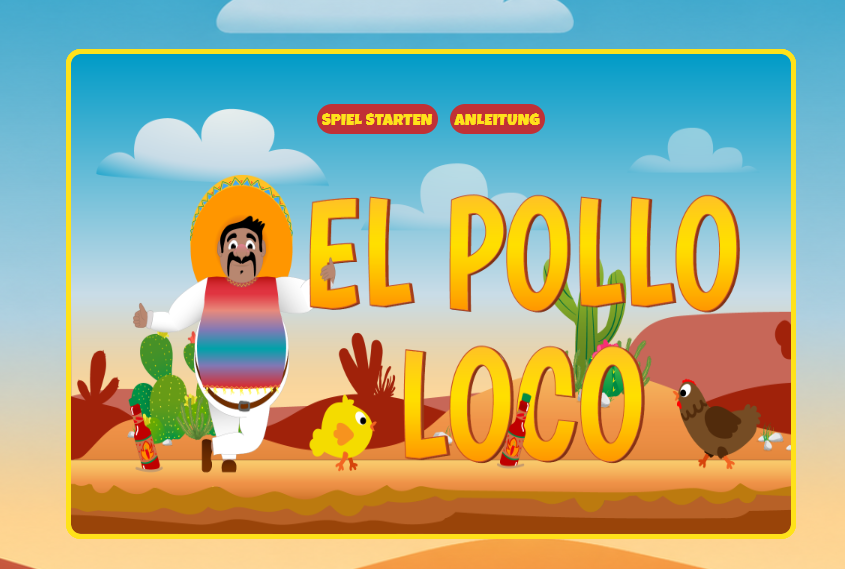
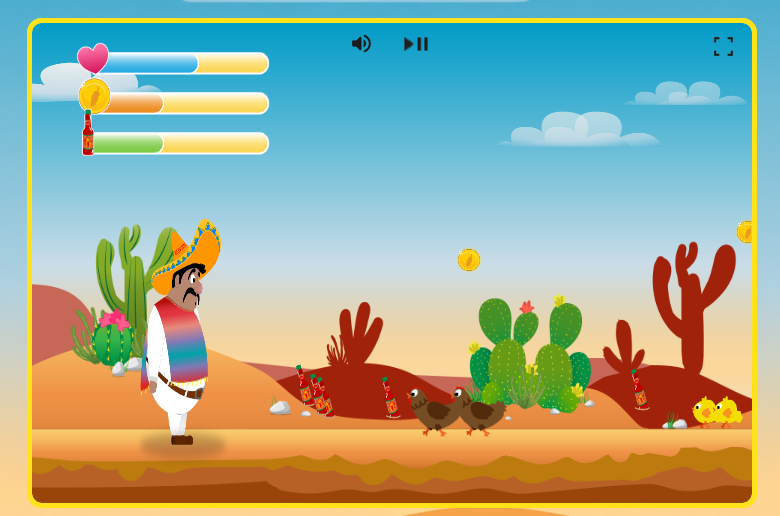
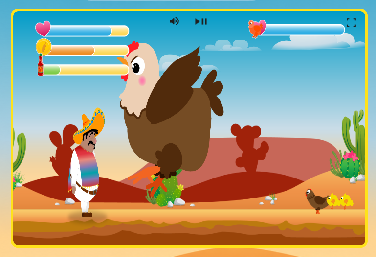

# El Pollo Loco 

A 2D browser-based platform game built with JavaScript, HTML, and CSS. Control Pepe as he jumps, throws bottles, fights enemies, collects coins, and battles the final boss in a desert-themed adventure.

## Screenshots

## Controls

| Action | Key |
|---|---|
| Move left / right | `←` `→` |
| Jump | `Space` |
| Throw bottle | `D` |

Touch controls are available on mobile devices.

## Features

- Character animation, gravity, and collision system
- Enemies, coins, bottles, and an end boss with health bar
- Sound effects and background music with mute toggle
- Responsive layout with mobile touch controls and orientation detection

## Play

Open `index.html` in your browser, or serve the folder with a local dev server.

## Tech Stack

JavaScript (OOP, Canvas API), HTML5, CSS3
